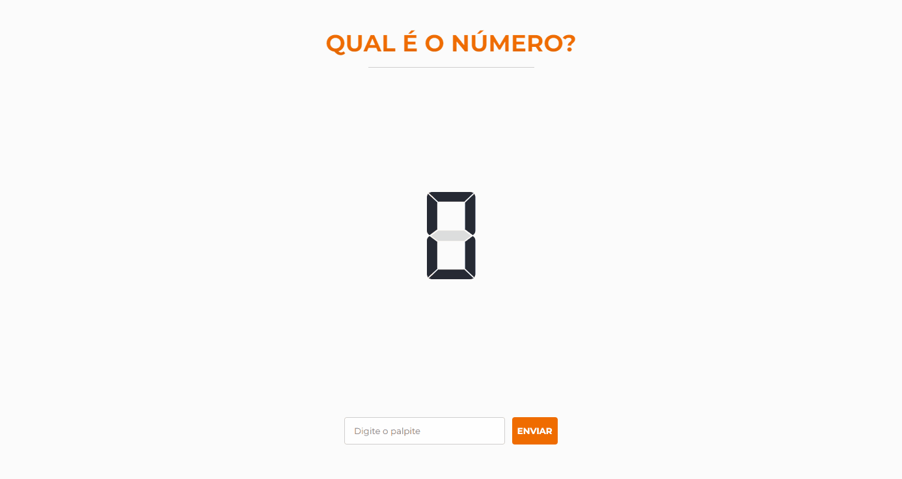

<h1 align="center">Qual o Número?</h1>

<p align="center">Jogo que consiste em descobrir o número correto.<p>

<p align="center">
    <a href="#pre-requisitos">Pré-Requisitos</a> •
    <a href="#rodando-a-aplicacao">Rodando a Aplicação</a> •
    <a href="#tecnologias">Tecnologias</a> •
    <a href="#autor">Autor</a>
<p>

---
<a href="https://qual-o-numero-dududornelees.netlify.app/" target="_blank">
        
</a>

<p align="center">Clique <a href="https://qual-o-numero-dududornelees.netlify.app/" target="_blank">aqui</a> para abrir o site da aplicação!</p>


<h3 id="pre-requisitos">Pré-Requisitos</h3>
Antes de começar, você vai precisar ter instalado em sua máquina as seguinte ferramentas: <a href="https://git-scm.com" target="_blank">Git</a>, <a href="https://nodejs.org/en/" target="_blank">Node.js</a>. <br>
Além disto, é bom ter um editor para trabalhar com o código, como o <a href="https://code.visualstudio.com/" target="_blank">VSCode</a>.


<h3 id="rodando-a-aplicacao">Rodando a Aplicação</h3>

```bash
# Clone o repositório
$ git clone https://github.com/dududornelees/qual-o-numero.git

# Acesse a pasta do projeto no terminal
$ cd qual-o-numero

# Instale as dependencias
$ yarn

# Inicie a aplicação
$ yarn start

# O servidor iniciará na porta: 3000. Acesse http://localhost:3000
```


<h3 id="tecnologias">Tecnologias</h3>
As seguintes ferramentas foram utilizadas na construção deste projeto:

- [React](https://pt-br.reactjs.org/)
- [Context API](https://pt-br.reactjs.org/docs/context.html)


---


<h3 id="autor">Autor</h3>


Made with 💙 by Eduardo Dorneles 👋.

[](https://www.linkedin.com/in/dududornelees/) [](https://dududornelees.com.br/)